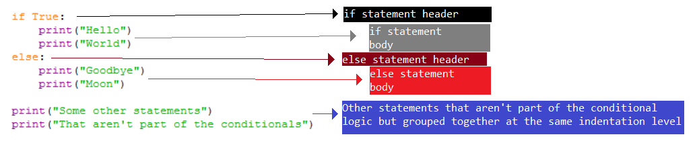

# Conditionals

- Python for Kids - Chapter 5 - Asking Questions with If and Else	
- <https://www.tutorialspoint.com/python3/python_decision_making.htm>
- <https://www.tutorialspoint.com/python3/python_if_statement.htm>
- <https://www.tutorialspoint.com/python3/python_if_else.htm>
- <https://www.tutorialspoint.com/python3/nested_if_statements_in_python.htm>
- Teach Your Kids to Code - Chapter 5 - Conditions (What If?) - p.84-86	
- Teach Your Kids to Code - Chapter 5 - Conditions (What If?) - p.91-94	
- Python Crash Course - Chapter 5 - If Statements	
- Learn Python 3 the Hard Way - Exercise 29 - What If	
- Learn Python 3 the Hard Way - Exercise 30 - Else and If	
- Learn Python 3 the Hard Way - Exercise 31 - Making Decisions	
- [Program Arcade Games with Python and Pygame - Chapter 3 - Quiz Games and If Statements](http://programarcadegames.com/index.php?lang=en&chapter=conditional_statements)
- https://www.learnpython.org/en/Conditions	
- Python Programming for the Absolute Beginner - Chapter 3 - Branching, while Loops, and Program Planning: The Guess My Number Game - p.53-63
- [If Statements Handout](https://docs.google.com/document/d/1SFSIDfRdPbKLUpCU3pV8SAAvKsjZGeKa0cZOWZNCukU/)
- <https://en.wikibooks.org/wiki/Non-Programmer%27s_Tutorial_for_Python_3/Decisions>
- <https://www.codequizzes.com/python/beginner-I/conditionals-if-elif-else>
- <https://realpython.com/python-conditional-statements/>

When using conditional statements like `if`, it's important for code to be properly indented.
You need to understand how indentation determines what is "part of" or "not part of" a conditional statement.

A conditional statement like `if` consists of what could be thought of as a "header" and a "body":
```
header:
    body
```

The "body" is defined by what is indented more to the right from the header.  For example,
in the following `if` statement, the "body" consists of a single line of code that is `print("Hello")`:
```
if True:
    print("Hello")
```

A body can consist of multiple statements, but only statements that are properly indented are actually
part of the entirety of the `if` statement.  If a statement is unindented so that it is not indented
more than the `if` statement header, then it's not part of the body:
```
if True:
    print("This line is part of the if statement's body.")
    print("This line is also part of the if statement's body.")
print("This line isn't part of the if statement's body because it isn't indented more.")
```

When looking at and reading code, you want to be able to use the indentation to read code
and see "blocks" that form clear sections of your code.  For example, you want to be able
to easily "see" the different color-coded blocks as shown in the image below:

