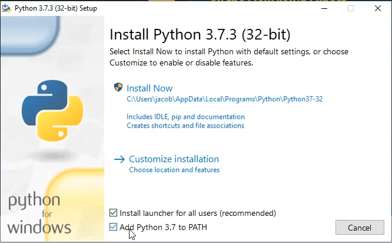
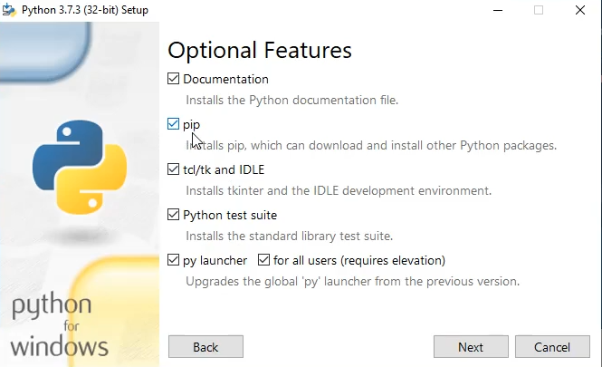
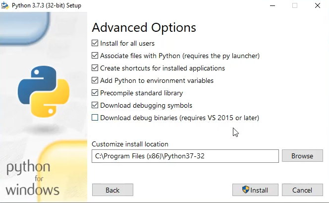
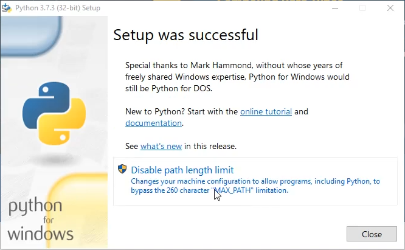

# Installing Python

In order to use Python, you'll need to download and install it on your computer.
To get Python, simply go to <https://python.org/> and click the appropriate item
underneath the "Downloads" menu for your operating system/platform.  In most cases,
the correct option will be displayed by default.

You can largely just follow the on-screen prompts to install Python.  While the default
settings will work, I do not recommend using them since that will hinder your future work.

Below shows some key points of the installation process on Windows.  A video is available
at <https://www.youtube.com/watch?v=VXLq8CNkoIA> if you'd like to watch a live video.

On the main screen, I recommend:
- Installing for all users
- Adding Python to the PATH
- Customizing your installation (default settings will work but may be limiting in the future)

On the "optional features" screen, I recommend installing all options.
In particular, "pip" is important to install in order to let you easily install
other Python libraries in the future.

On the "advanced options" screen, I recommend checking the boxes shown below
(you don't need to check the "Download debug binaries" option unless you really
know what you're doing).  You can change the path for the install location to
be whatever you want - but it's important that you remember where you install Python.

After installation basically completes, the final screen should look something like the
following.  It is recommended to disable the path length limit to avoid issues with
Python potentially accessing your files later:

